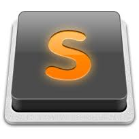

For the past few years, I have been actively programming for both school and my own personal projects. As I searched for a text editor that satisfied my visual and practical needs, I knew a few key components were absolutely necessary for me to be happy using the environment daily:

1. **Dark Mode** : I can't stand looking at a mostly white screen for long periods of time. I use Flux or other similar screen reddening software on almost every device I own so that my eyes are less strained at night. Dark mode is a must.
2. **Comprehensive Shortcuts** : I love keyboard shortcuts. Being able to quickly move around the page, modify text, and find things without having to leave the keyboard makes life so much easier. Most environments allow you to customize shortcuts, but that can be a lot of work and not all features are availabe in every environment (i.e. simultaneously modifying the same word at once). So a predefined list typically maps the shortcuts to an optimal arrangement of keys based on the features, and is why I look for a good list of shortcuts and features already predefined when I try new text editors.
3. **Theming** : Some people really like making their text and background a blueish color. Others look for neon colors. I tend to like a greyish-reddish color scheme. A rustic red color for text complemented with other earthy colors on a clay colored background has a nice, warm feel to it. Being able to choose from or import themes is also a necessary feature for me.
4. **Speed** : Slow startups and not being able to type at full speed are life or death for a text editor. I would rather use notepad++ if it means I can type as fast as I want and not have to correct every few words because the editor lagged and overwrote a previous word. If there is a noticeable lag, I'm not even going to consider using the editor.

 

So, with these in mind, after using everything from Atom to Vi, I found that VS Code and Sublime Text were my two favorite editors (with Vim as another solid candidate when resources are limited). Atom tended to lag a lot, to the point where I would just revert back to Sublime or Vim after an hour of giving it another chance.

Here are six reasons, in no particular order, I find VS Code to be an overall better text editor that Sublime Text:

1. UI/UX : While both editors provide a lot of customization options for themes and other tweaks, I found VS Code's One Monokai is unmatched in terms of being the ideal dark theme. I found it by using the Extensions tab and searching for themes, similar to using Sublime Text's Package Control plugin. Obviously similar themes exist on Sublime Text, and I could probably create custom definitions for other UX components, but One Monokai met my needs with zero extra work. And even without these changes, the default UX for VS Code is much better in my opinion than Sublime Text.
2. Stability : Sublime Text is a great editor overall, and very fast. But it did occassionally crash for me during use. Never has VS Code crashed. Like, never. And I've been using it daily for the past month. So hopefully this trend continues...
3. Built-in Git integration : VS Code, like Atom, has built-in Git integration. Sublime Text has a plugin that comes close, but is not as robust. The diff viewer is awesome and really easy to understand.
4. Performance : Sublime Text's uses Python as its language of choice for its API, while VS Code uses Typescript/Javascript. This means that VS Code's extensions will typically be much faster than Sublime Text's plugins. According to VS Code's website, the editor's architecture is based on [Electron](https://github.com/electron/electron) to "combine web technologies such as Javascript and Node.js with the speed and flexibility of native apps." Basically, it is really fast on all platforms.
5. Free : While you can use Sublime Text for free, you get prompted consistently with an annoying pop-up that asks you to pay the developers. VS Code on the other hand was made to be free. 
6. Easy updates: VS Code and extensions are easily updated. A banner appears at the top of the editor to update the actual editor, while a small notification at the bottom right of the extensions icon shows how many extensions can be updated. Quicky, easy, and not in your face like the Sublime Text pop-ups. 

I know those reasons might not be super-convincing, since Sublime has each of these features in some shape or form. Both are great editors and, as I stated earlier, are my top two favorite editors (besides Vim). I encourage everyone who hasn't at least tried VS Code to give it a shot. I think you will like it :) . 

Happy developing!